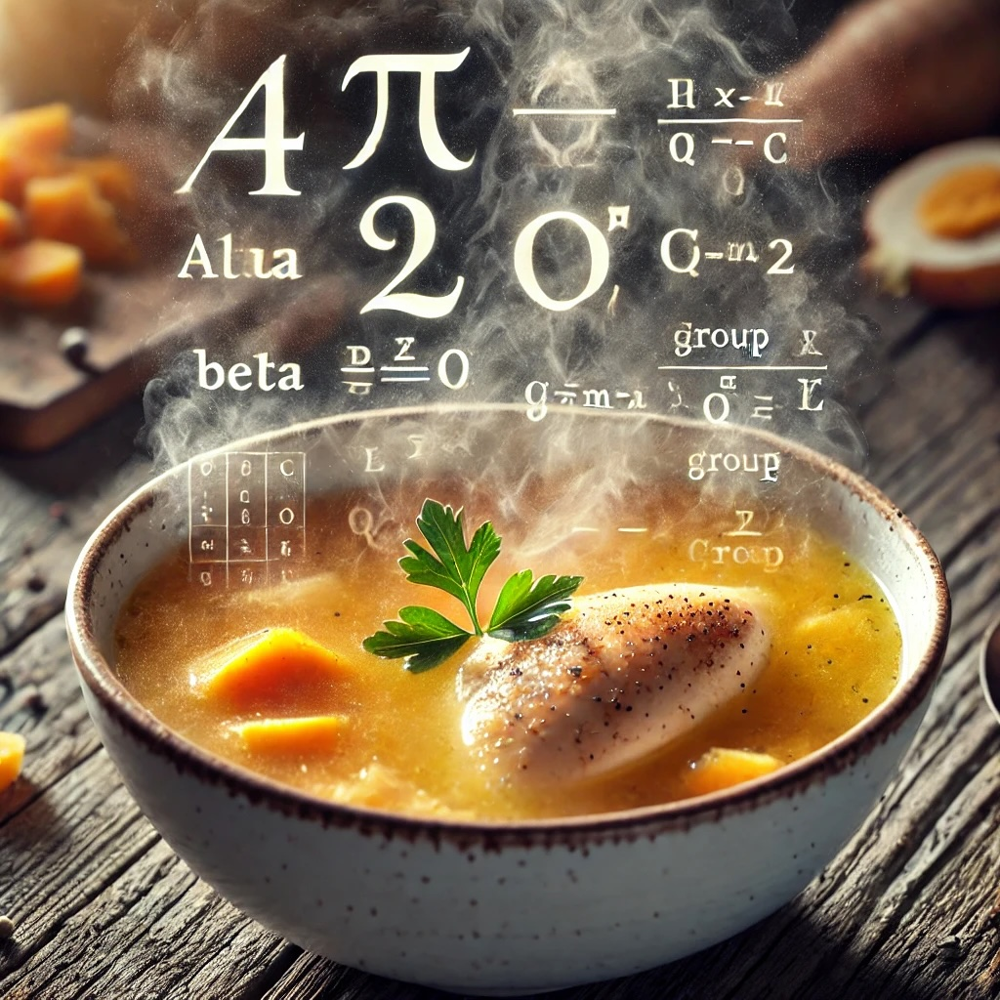

# broth16

This is an exercise to learn how Groth16 works. Consider it a toy implementation. DO NOT USE IT FOR ANYTHING SERIOUS.

## Curve

The curve used in this implementation is BLS12-381. It's also using my [toy implementation of asymmetric pairings on BLS12-381](https://github.com/kevincharm/blstoise).

## Useful reference material

-   J. Groth, [On the Size of Pairing-based Non-interactive Arguments](https://eprint.iacr.org/2016/260.pdf)
-   V. Buterin, [Quadratic Arithmetic Programs: from Zero to Hero](https://medium.com/@VitalikButerin/quadratic-arithmetic-programs-from-zero-to-hero-f6d558cea649)
-   N. Gailly, [playsnark](https://github.com/nikkolasg/playsnark)
